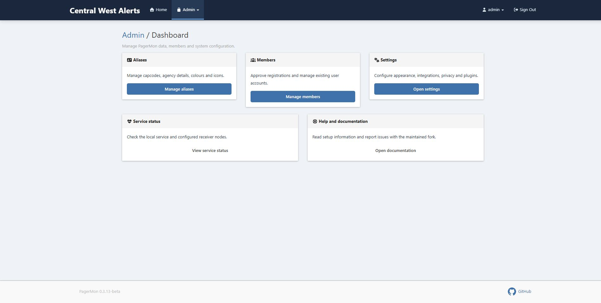
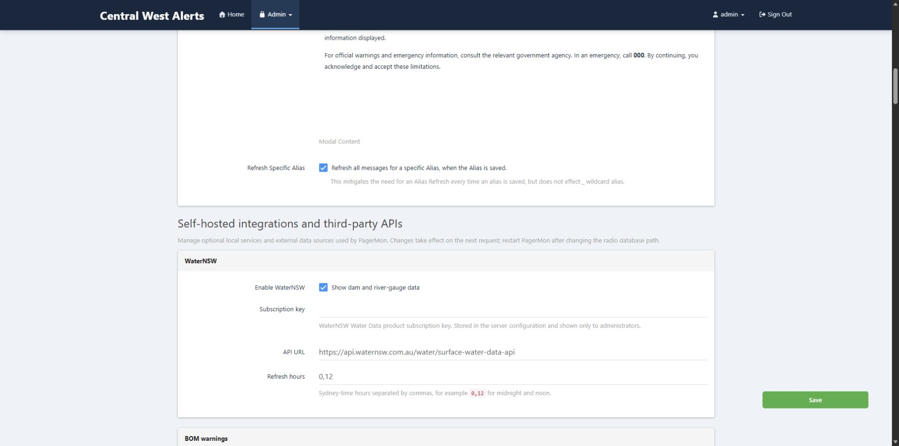

# PagerMon maintained fork

A maintained PagerMon client/server platform for receiving, decoding and presenting pager traffic. It accepts decoded POCSAG, FLEX and EAS messages from one or more local or remote receivers and provides aliases, searching, incident tools, maps, notifications and integrations through a browser-based interface.

This fork preserves the original PagerMon workflow while modernising its dependencies, Docker deployment, themes, mobile experience and administration tools.

> PagerMon is a monitoring aid. It must not be relied upon for emergency warnings, dispatch decisions or personal safety decisions. Always use official agency information.

## Screenshots

### Administration dashboard



### Self-hosted integrations and third-party APIs



## Highlights

- POCSAG, FLEX and EAS ingestion through `multimon-ng`
- Multiple local or remote receiver sources
- Capcode aliases, agencies, colours and icons
- CSV alias import/export and alias templates
- Duplicate filtering, text highlighting and regex replacement
- Optional Australian phone-number redaction
- Incident grouping, discovery queue and locality detection
- Live map with optional RFS, BOM, WaterNSW, PiAware and weather-radar data
- Rdio Scanner call-feed integration
- Browser/PWA support with selectable icons and installable themes
- Default, Dark Blue and Bushfire themes
- Per-member Web Push notifications for a selected capcode
- Optional administrator approval for new accounts
- Local service health plus configurable remote-receiver heartbeats
- Simple and Advanced HTTP webhooks
- Additional delivery plugins including Gotify, Pushover, Telegram, Discord, SMTP, Slack and Microsoft Teams
- SQLite, MySQL/MariaDB and Oracle database support

## Requirements

### Server

- A current Linux distribution
- Node.js 20 or newer for a bare-metal installation, or Docker with Compose
- SQLite for the default database
- A reverse proxy with HTTPS when exposing PagerMon externally

### Radio receiver

- An RTL2832U-compatible SDR or another receiver capable of providing discriminator/baseband audio
- `rtl_fm` from rtl-sdr
- `multimon-ng`
- The PagerMon client from this repository

Reception and decoding laws vary by location. Only monitor services you are legally permitted to receive.

## Quick start with Docker Compose

Docker Compose is the recommended server installation.

```bash
git clone https://github.com/rodgrech/pagermon.git
cd pagermon
docker compose up -d --build
```

Open:

```text
http://SERVER-IP:3000
```

The initial login is:

```text
Username: admin
Password: changeme
```

Change that password immediately under **My Profile**.

Persistent configuration, the SQLite database and generated Web Push keys are stored in:

```text
./data
```

The supplied Compose configuration:

- builds the maintained server from `server/Dockerfile`
- publishes port `3000`
- stores persistent state in `./data:/config`
- uses the `Australia/Sydney` timezone by default
- restarts automatically
- provides a Docker health check
- permits the supervised Admin → Restart PagerMon action

### Optional Compose environment variables

Create a `.env` file beside `docker-compose.yml` when overrides are required:

```dotenv
TZ=Australia/Sydney
PAGERMON_HOSTNAME=alerts.example.com
USE_COOKIE_HOST=false
APP_NAME=pagermon
PAGERMON_ALLOW_WEB_RESTART=true
```

After changing source files or pulling an update:

```bash
git pull
docker compose up -d --build pagermon
docker compose ps
```

View logs with:

```bash
docker compose logs -f --tail=200 pagermon
```

## Bare-metal server installation

The following example is suitable for current Debian/Ubuntu systems after Node.js 20 has been installed:

```bash
sudo apt update
sudo apt install -y git sqlite3 build-essential
git clone https://github.com/rodgrech/pagermon.git
cd pagermon/server
npm ci --omit=optional
cp config/default.json config/config.json
NODE_ENV=production npm start
```

Open `http://SERVER-IP:3000`, sign in with `admin / changeme`, then change the password and create an API key.

For a permanent installation, run PagerMon with systemd or another service supervisor. The service account must be able to write:

- `server/config/config.json`
- the configured SQLite database
- the receiver heartbeat cache beside the active configuration file

Do not run the web application as root.

### Updating bare metal

```bash
cd /path/to/pagermon
git pull
cd server
npm ci --omit=optional
sudo systemctl restart pagermon-server
sudo systemctl status pagermon-server
```

Adjust the service name to match your installation.

## Administrator two-factor authentication

Each administrator can enrol a standard TOTP authenticator from **My Profile → Administrator two-factor authentication**. The setup works with common authenticator apps and provides ten one-use recovery codes.

After every administrator has enrolled, an administrator may enable **Require admin 2FA** under **Admin → Settings → Accounts and access**. Trusted devices can be remembered for a configurable number of days. Another administrator can revoke an account's 2FA, recovery codes and remembered devices from **Admin → Users**.

Passwords remain bcrypt-hashed. TOTP seeds are encrypted at rest using AES-256-GCM with a key derived from `global.sessionSecret`; recovery codes and remembered-device tokens are stored as one-way hashes. Back up `global.sessionSecret` securely—changing it invalidates enrolled TOTP seeds.

## Receiver/client installation

Install the decoder dependencies on the receiver host:

```bash
sudo apt update
sudo apt install -y rtl-sdr multimon-ng nodejs npm git
git clone https://github.com/rodgrech/pagermon.git
cd pagermon/client
npm install
cp config/default.json config/config.json
```

Create an API key in **Admin → Settings → API keys**, then edit `client/config/config.json`:

```json
{
  "apikey": "YOUR_PAGERMON_API_KEY",
  "hostname": "https://alerts.example.com",
  "identifier": "Receiver1",
  "sendFunctionCode": false,
  "useTimestamp": true,
  "EAS": {
    "excludeEvents": [],
    "includeFIPS": [],
    "addressAddType": true
  }
}
```

- `apikey`: API key generated by the destination PagerMon server
- `hostname`: destination PagerMon URL
- `identifier`: source name shown with received messages
- `sendFunctionCode`: append the POCSAG function code to the address
- `useTimestamp`: use the decoder-provided timestamp

### RTL-SDR POCSAG example

Confirm the SDR index or serial first:

```bash
rtl_test -t
```

Example decoder pipeline:

```bash
rtl_fm -d 0 -f 148.5875M -M fm -s 22050 -g 30 -E dc -A fast - \
  | multimon-ng -q -b 1 -c \
      -a POCSAG512 -a POCSAG1200 -a POCSAG2400 \
      -f alpha -t raw /dev/stdin \
  | node reader.js
```

Replace the frequency, device selector and gain with values appropriate for your legal receive target and RF environment. A higher gain is not always better; strong local signals can overload the tuner.

If numeric/no-alpha messages must also be retained, test without `-f alpha` and confirm the resulting output format against `reader.js`.

## Remote receivers and service status

PagerMon always reports its own application health automatically.

To add a separate receiver node:

1. Open **Admin → Settings**.
2. Find **Monitoring and diagnostics → Service status**.
3. Select **Add remote receiver**.
4. Enter a stable Receiver ID, display name, location and frequency.
5. Save the settings.
6. Configure the remote heartbeat script to send the exact same Receiver ID.

New installations do not contain placeholder remote receivers. Heartbeat state is stored beside the active persistent configuration, making the feature portable between Docker and bare-metal installations.

The Service Status page is available to signed-in users from the account menu.

## Web Push notifications

1. Enable Web Push under **Admin → Settings → Push notifications**.
2. Restart PagerMon if the panel reports that service keys will be created after restart.
3. Each member opens **My Profile**.
4. The member selects one capcode and enables notifications on that device.

When Web Push is first enabled, PagerMon securely generates and persists its VAPID key pair. Do not delete or regenerate those keys casually; existing browser subscriptions depend on them.

On iOS, install PagerMon to the Home Screen before enabling Web Push. Notification actions vary by operating system, but selecting a notification opens the matching capcode feed.

## Administration

The reorganised admin interface contains:

- **General appearance and behaviour** — theme, PWA icon, monitor name, login image and visitor modal
- **Self-hosted integrations and third-party APIs** — WaterNSW, BOM, PiAware, Rdio Scanner, weather radar and webhooks
- **Live map** — interaction settings
- **Database** — database type and connection settings
- **Messages, privacy and alias tools** — filtering, redaction, visibility, regex rules and templates
- **Accounts and access** — registration and member approval
- **Push notifications** — Web Push state and key readiness
- **API keys** — decoder and integration credentials
- **Monitoring and diagnostics** — local service status, remote receivers and analytics
- **Message processing and delivery plugins** — remaining PagerMon plugins

Settings are shared by all installed themes.

## Themes and PWA

Available themes:

- Default
- Dark Blue
- Bushfire

The active theme and PWA icon set are selected under **Admin → Settings**. Theme changes require an application restart. The icon manifest is versioned when the icon set changes, although iOS may still require removing and re-adding an older Home Screen installation.

Administrators can also configure a login-only background image and watermark strength.

## Optional integrations

All integrations can be disabled. Disabled dashboard tabs and map assets are hidden.

- **WaterNSW** — dam, river-gauge and algae information using a WaterNSW subscription key
- **BOM warnings** — official warning feed with configurable local keywords
- **PiAware** — aircraft data from a local SkyAware `aircraft.json` feed
- **Rdio Scanner** — authenticated access to recent local scanner calls
- **Weather radar** — optional RainViewer overlay
- **Simple/Advanced Webhook** — HTTP delivery to another service

API availability, licensing and quotas remain the responsibility of the operator.

## Reverse proxy and security

For Internet-facing installations:

- use HTTPS
- place PagerMon behind a maintained reverse proxy
- enable sensible rate limits
- use a strong admin password and session secret
- require administrator approval for registrations when appropriate
- keep API keys private
- back up the persistent `data` or configuration directory
- keep Node.js, Docker and the host operating system updated

Do not publish the raw PagerMon port directly to the Internet when a reverse proxy can be used.

## Troubleshooting

### Docker container is unhealthy

```bash
docker compose ps
docker compose logs --tail=200 pagermon
curl -I http://127.0.0.1:3000/
```

### SDR is busy

```bash
pgrep -af 'rtl_test|rtl_fm|multimon-ng'
```

Only one process can normally claim an RTL-SDR at a time. Stop the old decoder or test process before starting another.

### No pager messages

- verify the correct SDR index/serial
- verify the receive frequency and antenna
- confirm `rtl_fm` is producing samples
- monitor `multimon-ng` output before piping it to `reader.js`
- test all expected POCSAG baud rates
- confirm the client API key validates against the intended server
- check clock synchronisation on the receiver and server
- remember that quiet periods can be normal

## Updating the “What’s new” notice

Release notes shown to signed-in users are stored in:

```text
server/config/whats-new.json
```

Increment `version` and update `changes` for each release. The modal appears once per signed-in user/browser for that release.

## Project history and acknowledgement

This repository is a maintained fork of the original [PagerMon project](https://github.com/pagermon/pagermon). Thanks to the original maintainers and contributors, and to:

- [multimon-ng](https://github.com/EliasOenal/multimon-ng)
- [jSAME](https://github.com/MaxwellDPS/jsame)

## Contributing

Issues and pull requests are welcome at [rodgrech/pagermon](https://github.com/rodgrech/pagermon).

Please avoid committing live API keys, private URLs, receiver IP addresses, pager content or user data.

## License

PagerMon is released under The Unlicense. See [LICENSE](LICENSE).
